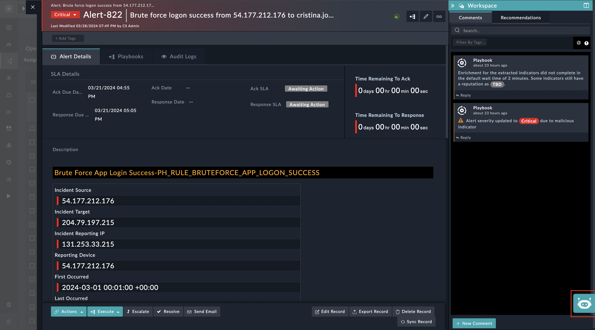
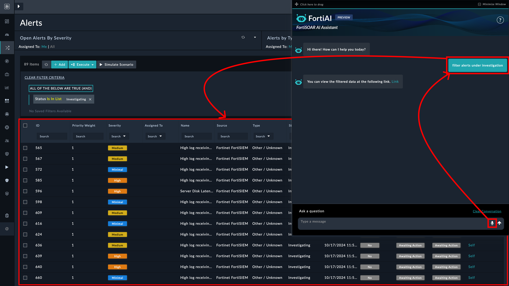
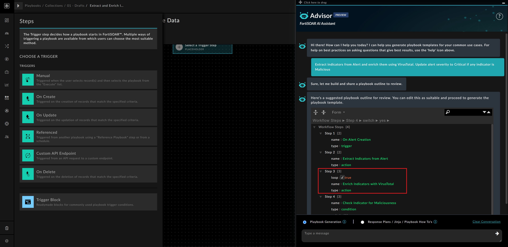
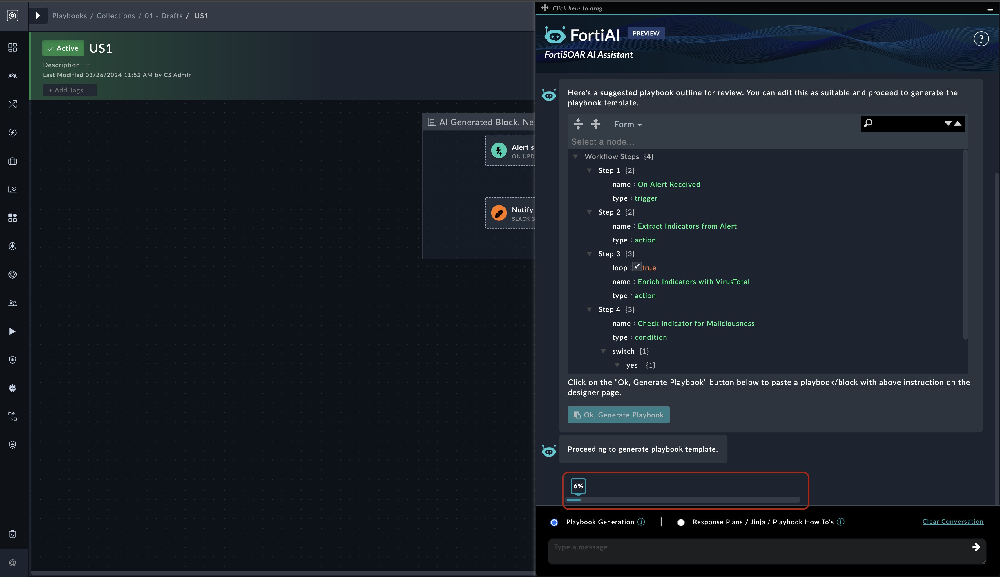
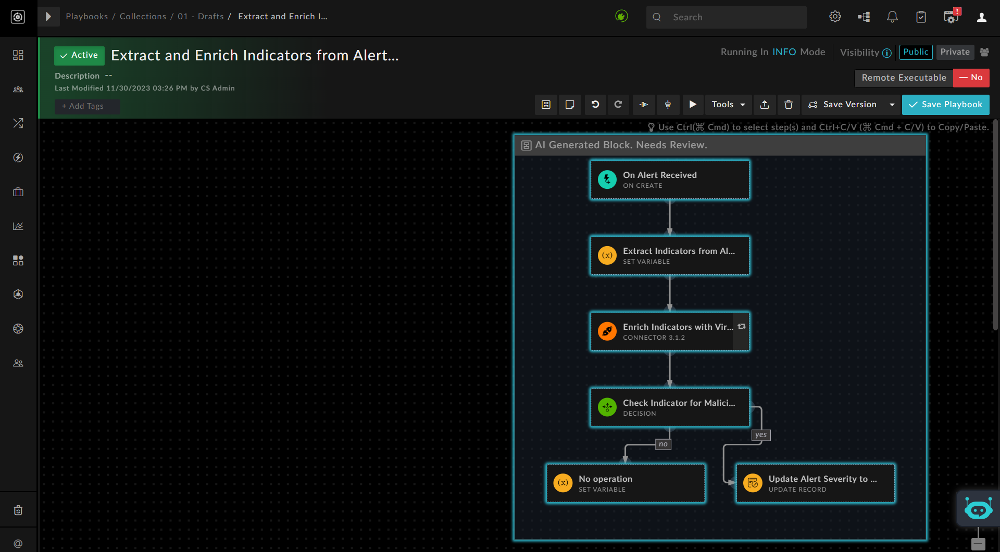
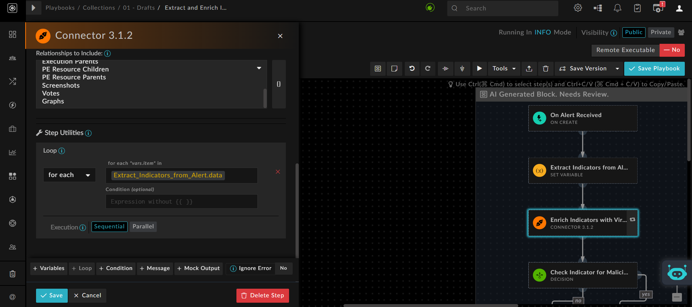
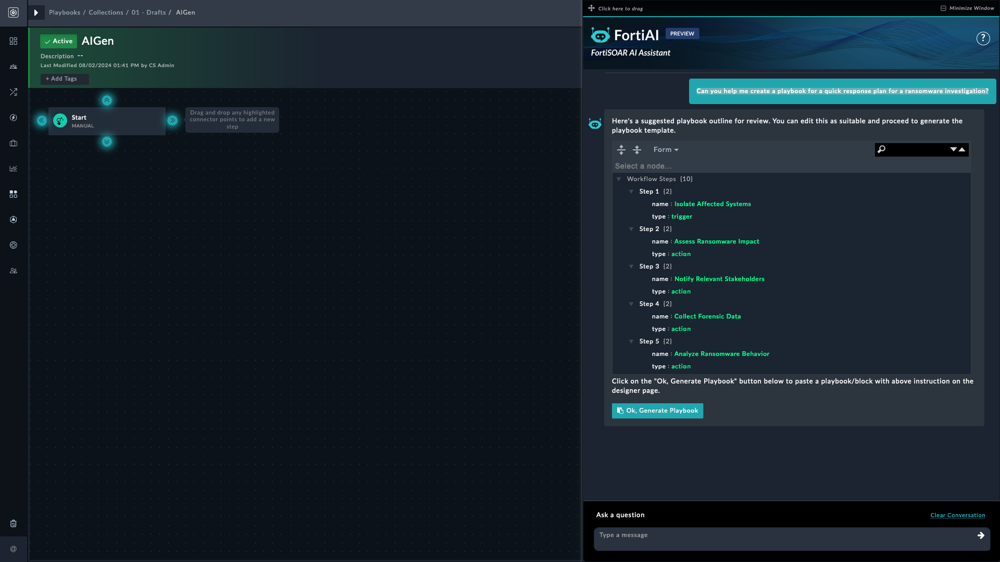
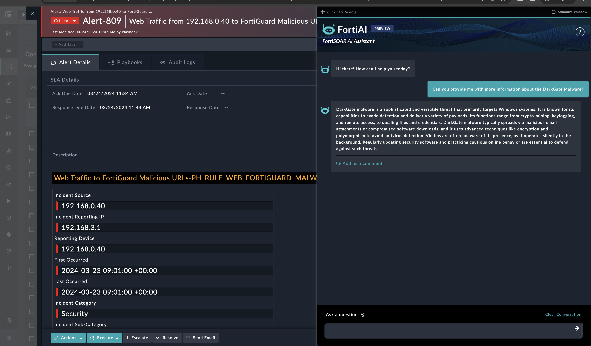
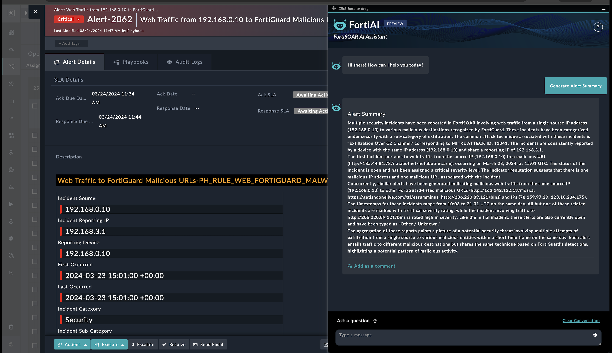
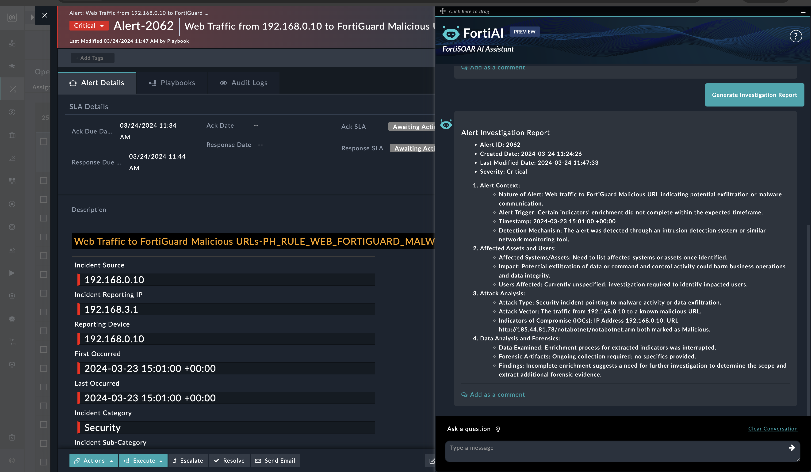

| [Home](../README.md) |
|----------------------|

# Usage

The AI Assistant Widget adds the **FortiAI** bot to both the list and detailed view of modules in FortiSOAR, as well as in the playbook designer. **FortiAI** is a valuable addition to your security toolkit; apart from making playbook design more efficient and insightful, it can understand and process contextual conversations like creation of alerts, indicators, module navigation, etc.. Whether you are new to security automation or a seasoned professional, **FortiAI** empowers you to create robust security playbooks that enhance your organization's cyber defenses. It also helps you in designing relevant response plans and offering contextual answers to your questions about different facets of security investigations and threat remediation, including creating comprehensive response plans, obtaining details on how to develop a specific kind of playbook, etc.

The **FortiAI** icon is visible in both the list view and detailed view of modules in FortiSOAR, as well as in the playbook designer. It is located on the lower-right corner, as shown in the following image of an alert detail view:

Click the icon to open the The **FortiAI** bot dialog to begin your interaction with the bot. Click ** Click here to drag** to drag the bot anywhere in the FortiSOAR application. Click the minimize button to minimize that dialog back into the icon:

To manually clear a conversation in the bot, click the **Clear Conversation** button.

>[!Note]
>Clearing a conversation deletes the thread and hence generative AIs, like OpenAI, may lose context.

## Playbooks Generation

Users can interact with the **FortiAI** bot to generate playbooks based on their requirements. You can engage in contextual conversation with the **FortiAI** bot and seek information related to work plans, best practices on developing a particular type of playbook, etc.  To generate playbook steps:

1. Open a playbook in the playbook designer
2. Click the icon to open the **FortiAI** bot and enter your requirements in the text box. For example, to design playbook steps that:
    - Extract indicators from an Alert
    - Enrich those indicators using VirusTotal
    - If an indicator is found to be *Malicious*, update the severity of that alert to **Critical**.

    Use the bot to design this playbook by entering the following prompt:

    >*`Extract indicators from Alert and enrich them using VirusTotal. Update alert severity to Critical if any indicator is Malicious`*

Based on this prompt, the bot dynamically generates a JSON template of the playbook block. This JSON format encapsulates the essential details of the playbook step, including actions, triggers, conditions, and relevant parameters: 

The **FortiAI** bot generates a *proposed* playbook outline in the JSON format.

>[!NOTE]
>*`It is advisable to review and update the JSON blocks as per your requirements`*.

For example, if you want to enrich indicators using IPStack instead of VirusTotal, you can change 'Step 3: Enrich Indicators with VirusTotal' to 'Step 3: Enrich Indicators with IPStack'.

Once you are satisfied with the JSON outline, click the **OK, Generate Playbook** button to start the process of generating the playbook steps. The **FortiAI** bot takes the input JSON and uses it to start an automated process that quickly generates the corresponding playbook block. As part of the automated generation process, the **FortiAI** bot checks and verifies the availability of connectors used in the generated playbook block and lists any connectors that are not currently installed or available in the FortiSOAR environment. 

Once the process starts for generating the playbook steps, a loader guides how much of the process is completed.

Once the process is complete, the playbook block is automatically pasted into the playbook designer, where it can be reviewed and used:

You can review the generated playbook block by opening specific steps and reviewing their details:

In the playbook designer, you can also ask for information about best practices, jinja, etc. The **FortiAI** bot provides insightful responses, leveraging its extensive knowledge base to provide you with guidance, recommendations, or information related to security threats, Jinja, best practices, response plan creation, etc. For example, if you want help designing a response plan for a ransomware event, you can click the **FortiAI** icon, type the following and then pressing **Enter**:

>*`Can you help me create a playbook for a quick response plan for a ransomware investigation?`*

 

The **FortiSOAR AI Assistant** bot offers a playbook as a response plan for a ransomware incident.

## Conversational

The **FortiAI** bot takes on an interactive role, offering valuable assistance through natural language conversations around threats, response procedures, etc., in the case management views such as while investigating an alert. For example, if you are in the context of a BFA alert, and you want to know more about that malware, click the **FortiAI** icon in the alert detail view, and in the **Ask a question** text box, type the following and then press **Enter**:

>*`Can you provide me with more information about the DarkGate Malware?`*

 

The **FortiAI** bot provides a summary of the malware and its associated threat groups.

## Module specific questions 

- Open any of the alerts and click on the bot icon. A few pre-defined questions appears.

  

- Click on any of the questions, and a dialog box appears to Review and Edit the data that will be sent to the LLM like OpenAI.

>[!NOTE]
>All sensitive and confidential information is masked automatically by the bot.

- Upon pressing the Enter key, the question prompt and module record data is submitted to the LLM and the user gets a response as shown in the following image:

  

- In another example, click on other questions like 'Generate Investigation Report' after opening an alert record, to see that alert's summary.

- And user gets a response as shown in the following image;

  

For additional use cases and tips and techniques to help you craft better prompts for receiving the best possible responses from the **FortiAI** bot, see the [FortiAI solution pack documentation](). 

| [Installation](./setup.md#installation) | [Configuration](./setup.md#configuration) |
|-----------------------------------------|-------------------------------------------|
