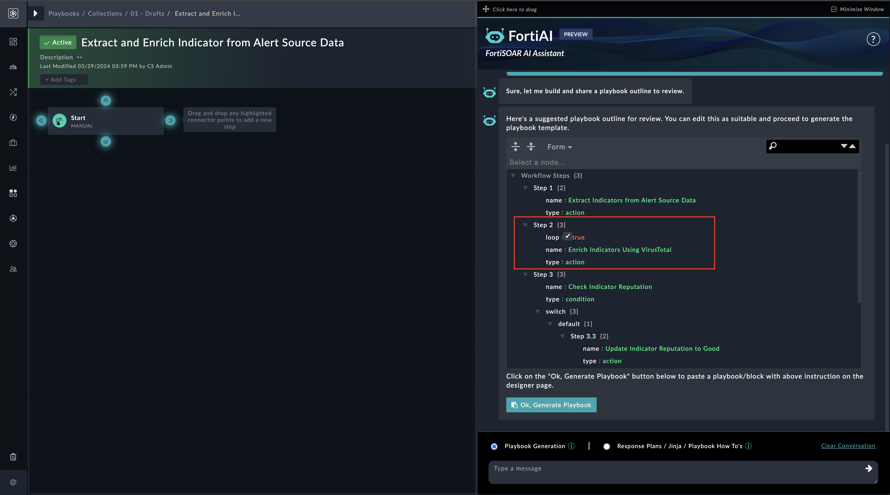

| [Home](../README.md) |
|----------------------|

# Usage

The AI Assistant Widget adds the 'FortiAI' bot to both the list view and detail view of modules in FortiSOAR, as well as in the playbook designer. 'FortiAI' is a valuable addition to your security toolkit, making playbook design more efficient and insightful. Whether you are new to security automation or a seasoned professional, 'FortiAI' empowers you to create robust security playbooks that enhance your organization's cyber defenses. It also helps you in designing relevant response plans and offering contextual answers to your questions about different facets of security investigations and threat remediation, including learning about of security processes to create comprehensive response plans, obtaining details on how to develop a specific kind of playbook, etc.

FortiAI operates in two distinct modes—Playbook Blocks and Conversation Mode—to provide intelligent assistance and guidance to security professionals.

The 'FortiAI' icon is visible in both the list view and detail view of modules in FortiSOAR, as well as in the playbook designer. It is located on the lower-right corner, as shown in the following image of an alert detail view:  

Click on the icon to open the FortiAI bot dialog in which you can begin your interaction with the bot. You can click '**Click here to drag**' to drag the bot anywhere in the FortiSOAR application, and clicking the minimize button minimizes that dialog back as an icon:  

To manually clear a conversation in bot, click the **Clear Conversation** button. Note, that Clear Conversation clears the conversation for that mode only, for example, if you are in the Conversation Mode, the conversation will be cleared for only this mode and not for the Playbook Generation mode. 

  >**NOTE**: When a user logs out, all conversations are automatically cleared.

## Prerequisites

For FortiAI to work, you must install and configure the following:

- FortiAI solution pack

## Playbook Blocks Mode

In Playbook Blocks mode, bot provides an innovative approach to streamline playbook creation and  management. Here's how it works:

### Playbooks Generation

Users can interact with FortiAI bot to generate playbooks based on their requirements. In the Playbook Generation mode, bot provides you with two options, the **Playbook Generation** option that provides you with a JSON outline for the required playbook steps, and the **Response Plans / Jinja / Playbooks How Tos** option that allows you to engage in contextual conversation with FortiAI and seek information related to work plans, best practices on developing a particular type of playbook, etc. 

To generate playbook steps, open a playbook in the playbook designer, and you will see the **FortiAI** icon on the lower-right corner. Click on the icon to open the FortiAI bot and enter your requirements in the text box. For example, you might need to design playbook steps that extracts indicators from an Alert, enriches those indicators using VirusTotal, and if any indicator is found to be 'Malicious', then updates the severity of that alert to 'Critical'. You can use bot to design this playbook by selecting the **Playbook Generation** option, typing `Extract indicators from Alert and enrich them using VirusTotal. Update alert severity to Critical if any indicator is Malicious`, and then pressing **Enter**. Based on this prompt, bot dynamically generates a JSON template of the playbook block. This JSON format encapsulates the essential details of the playbook step, including actions, triggers, conditions, and relevant parameters:  

FortiAI generates a proposed playbook outline in the JSON format. *<u>It is advisable to review and update the JSON blocks as per your requirements</u>*. For example, if you want to enrich indicators using IPStack instead of VirusTotal, you can change 'Step 3: Enrich Indicators with VirusTotal' to 'Step 3: Enrich Indicators with IPStack'.

Once you are satisfied with the JSON outline, click the **Ok, Generate Playbook** button to start the process of generating the playbook steps. FortiAI takes the input JSON and uses it to start an automated process that quickly generates the corresponding playbook block. As part of the automated generation process, FortiAI checks and verifies the availability of connectors used in the generated playbook block and lists any connectors that are not currently installed or available in the FortiSOAR environment. 

Once the process starts for generating the playbook steps, a loader guides how much of the process is completed.  

Once the process is complete, the playbook block is automatically pasted into the playbook designer, where it can be reviewed and used:

You can review the generated playbook block by opening specific steps and reviewing their details:   

In the playbook designer, you can also ask for information about best practices, jinja etc., by selecting the **Response Plans / Jinja / Playbooks How Tos** option. FortiAI provides insightful responses, leveraging its extensive knowledge base to provide you with guidance, recommendations, or information related to security threats, Jinja, best practices, response plan creation, etc. For example, if you want help designing a response plan for a ransomware event, you can click the **FortiAI** icon, select the **Response Plans / Jinja / Playbooks How Tos** option, and type `Can you help me with a quick response plan for a ransomware investigation?` and then pressing **Enter**:

 

FortiAI offers a set of procedures to follow when creating a response plan for a ransomware incident. You can use these steps to develop playbooks for handling such a scenario.

## Conversation Mode:

In Conversation Mode, FortiAI bot takes on a more interactive role, offering valuable assistance through natural language conversations around threats, response procedures, etc., in the case management views such as while investigating an alert. For example, if you are in context of a BFA alert, and you want to know more about that malware, click the **FortiAI** icon in the alert detail view and in the **Ask a question** text box, type `Can you provide me with more information about the DarkGate Malware?` and then press **Enter**:   

 

FortiAI bot provides a summary about the malware and its associated threat groups.

### Module Specific Question 

- Open any of the alerts and click on the bot icon. A few pre-defined questions will appear.

  

- Click on any of the questions, and a dialog box will appear to Review and Edit the data that will be sent to the LLM like OpenAI.
  >**NOTE**: All sensitive and confidential information will be masked automatically by a bot. Please review it carefully and edit before submitting it to LLM.
  

  

- Upon clicking 'Submit & Get AI's Response' button the question prompt and module record data will be submitted to the LLM like OpenAI and user will get a response as shown below;

  

- In an another example, click on other question like 'Generate Investigation Report' as shown below;

  

- And user will get a response as shown below;

  

For additional use cases and tips and techniques to help you craft better prompts for receiving the best possible responses from FortiAI, see the [FortiAI solution pack documentation](). 

| [Installation](./setup.md#installation) | [Configuration](./setup.md#configuration) |
| --------------------------------------- | ---------------------------------------- |
